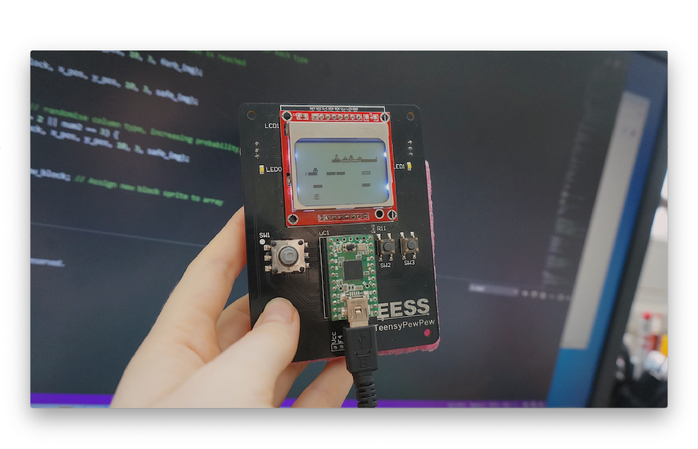

# Embedded C Microcontroller Game  (CAB202 Assignment 2)

This is a TeensyPewPew program that emulates a player moving through a series of static and moving blocks. The aim of the player is to move/jump between blocks while avoiding zombies, gaining points and lives. 

#### Specialised Teensy Functionality includes:
- Analog to Digital Conversion (with the use of one potentiometer) to control the movement of blocks
-	Both LED0 and LED1 synchronously flash at approximately 4Hz before the zombies spawn and continue to flash until all the zombies have landed or fallen off screen
-	Pulse Width Modulation is used to control the backlight when the player loses a life (but not the last time, when lives reach 0) and respawns
-	Serial communication is used to send information to a computer for events such as the game starting, the player dying and zombies appearing. 
- USB serial communication can be used to control the Teensy Game (including for the 's' key to start the game from the intro screen, 'a' to move the character left, 'd' to move the character right, and 'w' to let the character jump)
- All switches that are used in the program are debounced efficiently

## Source Code
Unfortunately the source code cannot be released publicly, due to [QUT’s academic policy](http://www.mopp.qut.edu.au/C/C_05_03.jsp#C_05_03.06.mdoc). However, I am happy to provide prospective employers with a unique link to the private repository.
